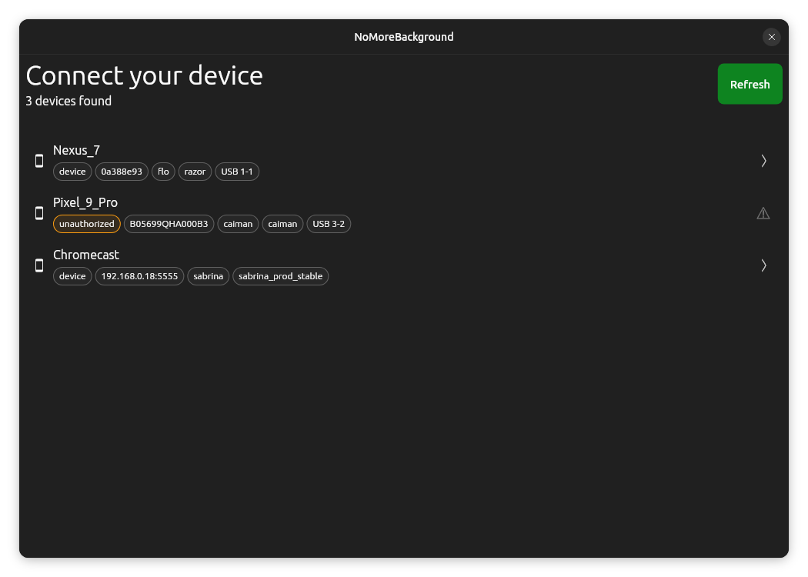
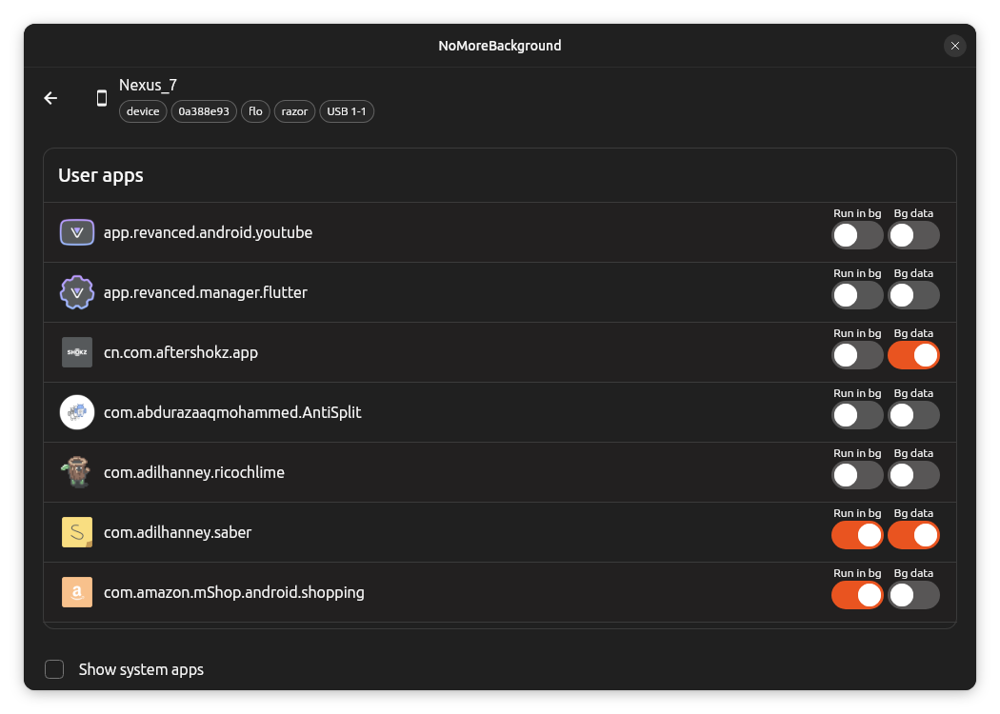

# NoMoreBackground

A fire-and-forget program to stop Android apps from running in the background.

## Install

Install NoMoreBackground on...
1. Linux

   Search for NoMoreBackground in your app store or go to https://flathub.org/apps/com.adilhanney.no_more_background
2. Windows

   Download the [archive](https://github.com/adil192/no_more_background/releases/latest/download/NoMoreBackground-Windows-x64.zip),
   extract it somewhere, and run `no_more_background.exe`.


## Usage

If using Windows, install `adb` on your computer. `adb` is already bundled on Linux so this step isn't necessary.

Connect your Android device to your computer with a cable.
In `no_more_background`, tap your device in the list. If you don't see your device, you may wish to check out Google's [troubleshooting guide](https://developer.android.com/studio/run/device#troubleshoot).



You'll see a list of apps installed on your device.
Use the checkboxes to choose which apps can run in the background, and which apps can access data in the background.



That's it! Close no_more_background and move on with your life.

## Manual method

no_more_background is just a convenient way to manage all your apps in one place, but you can do the exact same thing manually on the Android device.

For each app:
1. Open Settings → Apps → [Find your app].
2. In "App battery usage", disable "Allow background usage".
3. In "Mobile data usage", disable "Background data".

You have to repeat this process for each app, which quickly becomes tedious. no_more_background exposes these settings all in one page to make the process a little less painful.

## Building from source

1. [Install Flutter](https://flutter.dev/docs/get-started/install), e.g. with my script:
    ```bash
    curl -s https://raw.githubusercontent.com/adil192/adil192-linux/main/bootstrap/install_flutter.sh | bash
    ```
2. Clone this repository with its submodules:
    ```bash
    git clone --recurse-submodules https://github.com/adil192/no_more_background.git
    cd no_more_background
    ```
3. Get the dependencies:
    ```bash
    flutter pub get
    ```
4. Build the app:
    ```bash
    flutter build linux
    ```
5. Run the app:
    ```bash
    ./build/linux/x64/release/bundle/no_more_background
    ```
